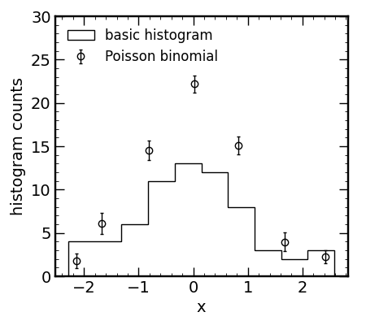

# histogram

Python functions to calculate the "true" histogram or population
fraction (ratio of a subset to the total distribution) for a 
dataset by accounting for uncertainties in the data.

For the more
statistics-oriented, this code treats histogram bins as sums of
individual Bernoulli trials in which a given datum lands within 
a histogram bin with some probability based on the distribution 
from which the datum was drawn. The resulting distribution for 
each histogram bin is therefore Poisson binomial and 
representative of the independent sampling of each datum from its
respective normal distribution (characterized by its uncertainty).

If the uncertainties are unknown, the Gehrels 1986 ApJ 303, 336 
formalism provides maximal confidence intervals in both the 
histogram and population fraction cases.

## References

While this code is provided publicly, I request that any use
thereof be cited in any publications in which this code is used.
The `hist_error` function and all functions related to the "true"
histogram solution were first developed and implemented in
Flury et al. 2022 ApJS 260, 1. The `fract_dist` function and all
related functions for the population fraction were first 
developed and implemented in Flury et al. 2022 ApJ 930, 126.

If no uncertainties are provided with the sample when using
any of the `histogram` functions, please also cite
Gehrels 1986 ApJ 303, 336.

## Example usage
``` python
from numpy.random import seed,randn 
from histogram import *
x = randn(66)
x_err = 0.1*(x+0.05*randn(len(x)))
c,b,clo,chi = hist_error(x,x_err=x_err)
```


## BibTeX references (as provided by NASA/ADS)
Flury et al. 2022 ApJS 260, 1
``` bibtex
@ARTICLE{2022ApJS..260....1F,
       author = {{Flury}, Sophia R. and {Jaskot}, Anne E. and {Ferguson}, Harry C. and {Worseck}, G{\'a}bor and {Makan}, Kirill and {Chisholm}, John and {Saldana-Lopez}, Alberto and {Schaerer}, Daniel and {McCandliss}, Stephan and {Wang}, Bingjie and {Ford}, N.~M. and {Heckman}, Timothy and {Ji}, Zhiyuan and {Giavalisco}, Mauro and {Amorin}, Ricardo and {Atek}, Hakim and {Blaizot}, Jeremy and {Borthakur}, Sanchayeeta and {Carr}, Cody and {Castellano}, Marco and {Cristiani}, Stefano and {De Barros}, Stephane and {Dickinson}, Mark and {Finkelstein}, Steven L. and {Fleming}, Brian and {Fontanot}, Fabio and {Garel}, Thibault and {Grazian}, Andrea and {Hayes}, Matthew and {Henry}, Alaina and {Mauerhofer}, Valentin and {Micheva}, Genoveva and {Oey}, M.~S. and {Ostlin}, Goran and {Papovich}, Casey and {Pentericci}, Laura and {Ravindranath}, Swara and {Rosdahl}, Joakim and {Rutkowski}, Michael and {Santini}, Paola and {Scarlata}, Claudia and {Teplitz}, Harry and {Thuan}, Trinh and {Trebitsch}, Maxime and {Vanzella}, Eros and {Verhamme}, Anne and {Xu}, Xinfeng},
        title = "{The Low-redshift Lyman Continuum Survey. I. New, Diverse Local Lyman Continuum Emitters}",
      journal = {\apjs},
     keywords = {Reionization, Galactic and extragalactic astronomy, Ultraviolet astronomy, Hubble Space Telescope, 1383, 563, 1736, 761, Astrophysics - Astrophysics of Galaxies, Astrophysics - Cosmology and Nongalactic Astrophysics},
         year = 2022,
        month = may,
       volume = {260},
       number = {1},
          eid = {1},
        pages = {1},
          doi = {10.3847/1538-4365/ac5331},
archivePrefix = {arXiv},
       eprint = {2201.11716},
 primaryClass = {astro-ph.GA},
       adsurl = {https://ui.adsabs.harvard.edu/abs/2022ApJS..260....1F},
      adsnote = {Provided by the SAO/NASA Astrophysics Data System}
}
```
Flury et al. 2022 ApJ 930, 126
``` bibtex
@ARTICLE{2022ApJ...930..126F,
       author = {{Flury}, Sophia R. and {Jaskot}, Anne E. and {Ferguson}, Harry C. and {Worseck}, G{\'a}bor and {Makan}, Kirill and {Chisholm}, John and {Saldana-Lopez}, Alberto and {Schaerer}, Daniel and {McCandliss}, Stephan R. and {Xu}, Xinfeng and {Wang}, Bingjie and {Oey}, M.~S. and {Ford}, N.~M. and {Heckman}, Timothy and {Ji}, Zhiyuan and {Giavalisco}, Mauro and {Amor{\'\i}n}, Ricardo and {Atek}, Hakim and {Blaizot}, Jeremy and {Borthakur}, Sanchayeeta and {Carr}, Cody and {Castellano}, Marco and {De Barros}, Stephane and {Dickinson}, Mark and {Finkelstein}, Steven L. and {Fleming}, Brian and {Fontanot}, Fabio and {Garel}, Thibault and {Grazian}, Andrea and {Hayes}, Matthew and {Henry}, Alaina and {Mauerhofer}, Valentin and {Micheva}, Genoveva and {Ostlin}, Goran and {Papovich}, Casey and {Pentericci}, Laura and {Ravindranath}, Swara and {Rosdahl}, Joakim and {Rutkowski}, Michael and {Santini}, Paola and {Scarlata}, Claudia and {Teplitz}, Harry and {Thuan}, Trinh and {Trebitsch}, Maxime and {Vanzella}, Eros and {Verhamme}, Anne},
        title = "{The Low-redshift Lyman Continuum Survey. II. New Insights into LyC Diagnostics}",
      journal = {\apj},
     keywords = {Reionization, Galactic and extragalactic astronomy, Hubble Space Telescope, Ultraviolet astronomy, Emission line galaxies, 1383, 563, 761, 1736, 459, Astrophysics - Astrophysics of Galaxies, Astrophysics - Cosmology and Nongalactic Astrophysics},
         year = 2022,
        month = may,
       volume = {930},
       number = {2},
          eid = {126},
        pages = {126},
          doi = {10.3847/1538-4357/ac61e4},
archivePrefix = {arXiv},
       eprint = {2203.15649},
 primaryClass = {astro-ph.GA},
       adsurl = {https://ui.adsabs.harvard.edu/abs/2022ApJ...930..126F},
      adsnote = {Provided by the SAO/NASA Astrophysics Data System}
}
```
Gehrels 1986 ApJ 303, 336
``` bibtex
@ARTICLE{1986ApJ...303..336G,
       author = {{Gehrels}, N.},
        title = "{Confidence Limits for Small Numbers of Events in Astrophysical Data}",
      journal = {\apj},
     keywords = {Astrophysics, Binomial Theorem, Confidence Limits, Data Processing, Poisson Density Functions, Approximation, Tables (Data), Astrophysics, NUMERICAL METHODS},
         year = 1986,
        month = apr,
       volume = {303},
        pages = {336},
          doi = {10.1086/164079},
       adsurl = {https://ui.adsabs.harvard.edu/abs/1986ApJ...303..336G},
      adsnote = {Provided by the SAO/NASA Astrophysics Data System}
}
```

## Licensing

This program is free software: you can redistribute it and/or modify it under the terms of the GNU General Public License as published by the Free Software Foundation, either version 3 of the License, or (at your option) any later version.

This program is distributed in the hope that it will be useful, but WITHOUT ANY WARRANTY; without even the implied warranty of MERCHANTABILITY or FITNESS FOR A PARTICULAR PURPOSE. See the GNU General Public License for more details.

You should have received a copy of the GNU General Public License along with this program. If not, see <https://www.gnu.org/licenses/>.
